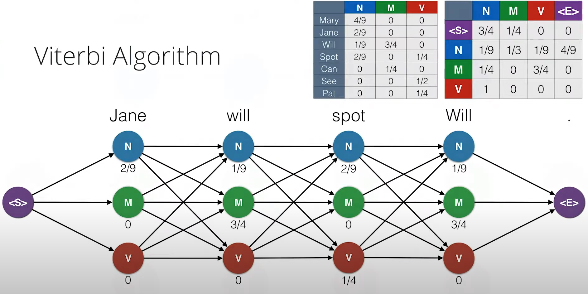
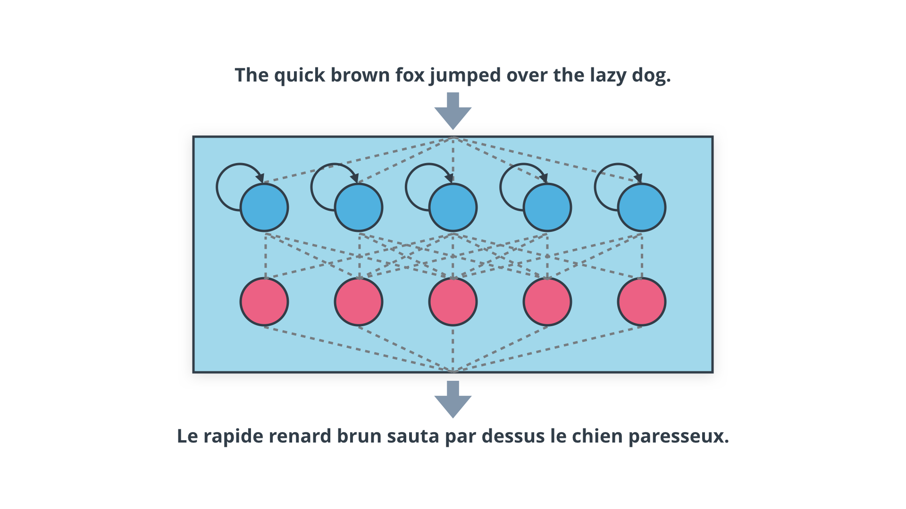
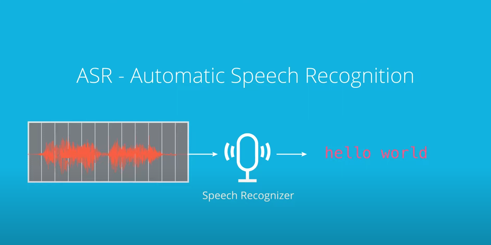

# NLP Nanodegree Program Projects

## Projects

### 01. [Part of Speech Tagging](https://github.com/PabloMazurkiewicz/Speech-Tagging-Part)

  
Description

  Implemented various techniques for part of speech tagging using table lookups, n-grams, and hidden Markov models. Built and trained a tagger with a hidden Markov model and compared the performances of different models on a dataset of sentences.

### 02. [Machine Translation](https://github.com/PabloMazurkiewicz/Neural-Machine-Translator)

  
Description

  Developed a deep neural network as part of an end-to-end machine translation pipeline. The pipeline processes English text and translates it to French using recurrent neural network architectures, with a focus on feature extraction, embeddings, and attention mechanisms.

### 03. [Speech Recognition](https://github.com/PabloMazurkiewicz/Neural-Speech-Recognizer)

  
Description

  Built an automatic speech recognition (ASR) model that converts raw audio into transcribed text. The project involved preprocessing audio data, extracting features, and mapping them to text using deep neural networks.

